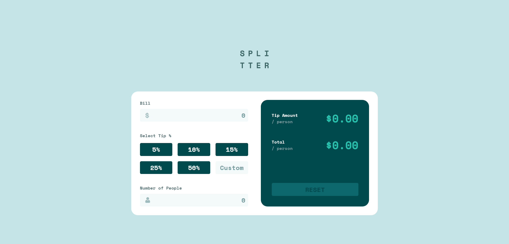
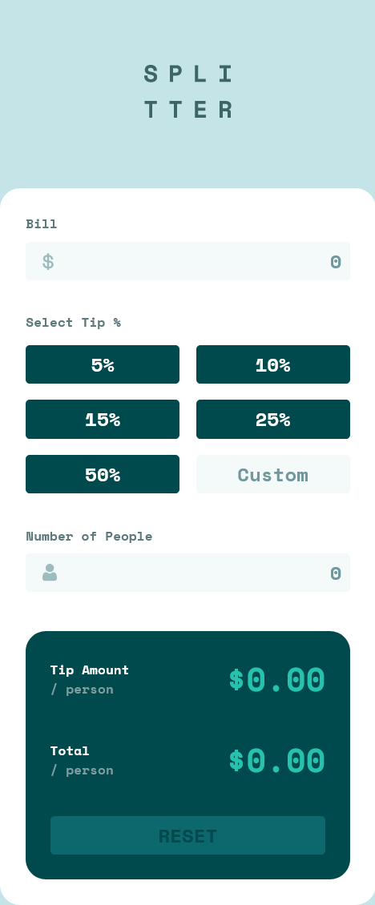

# Frontend Mentor - Tip calculator app

## Table of contents

- [Frontend Mentor - Tip calculator app](#frontend-mentor---tip-calculator-app)
  - [Table of contents](#table-of-contents)
  - [Overview](#overview)
    - [Screenshot](#screenshot)
    - [Links](#links)
  - [My process](#my-process)
    - [Built with](#built-with)
  - [Author](#author)

## Overview

### Screenshot

### Links

- Solution URL: [solution URL](https://jorge-david-reyes.github.io/Tip-calculator-app/)

## My process

### Built with

- Semantic HTML5 markup
- CSS custom properties
- Flexbox, Grid
- JS

## Author

- Frontend Mentor - [@Jorge-David-Reyes](https://www.frontendmentor.io/profile/Jorge-David-Reyes)

